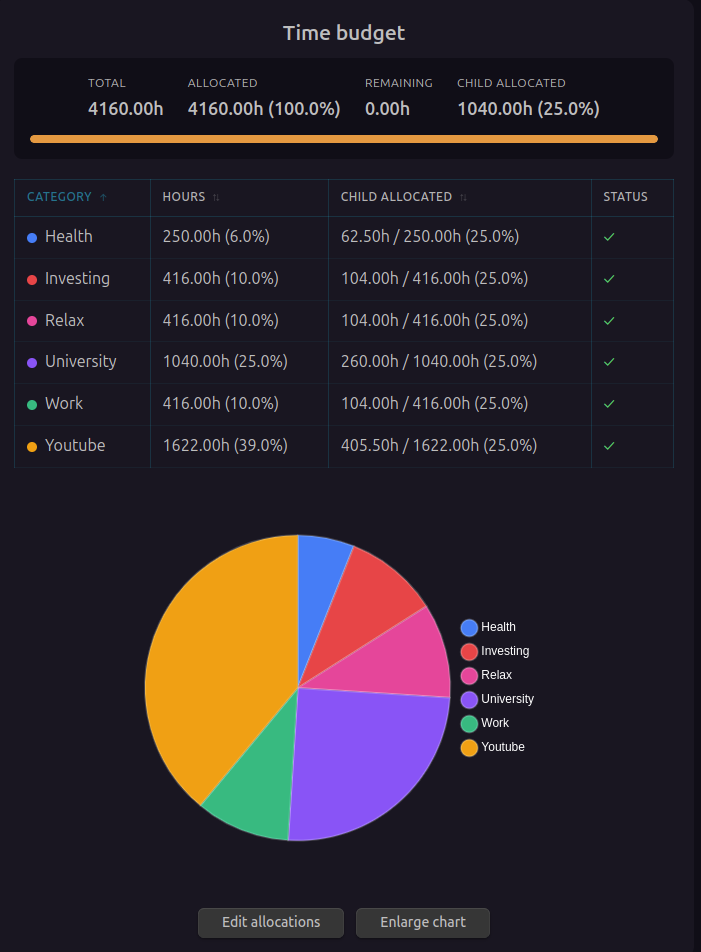
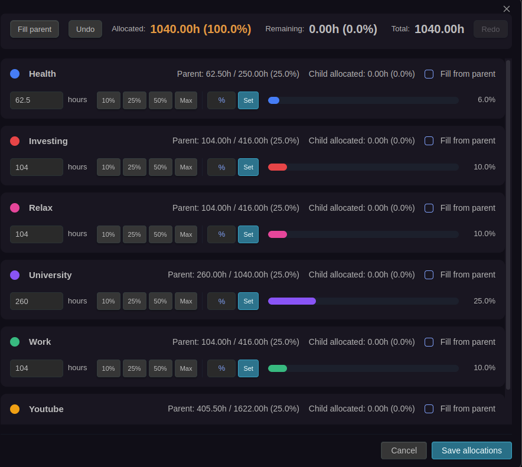
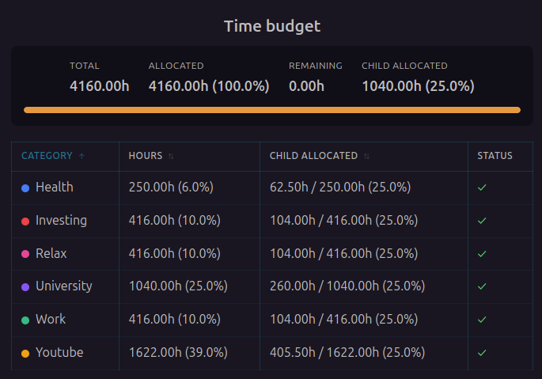
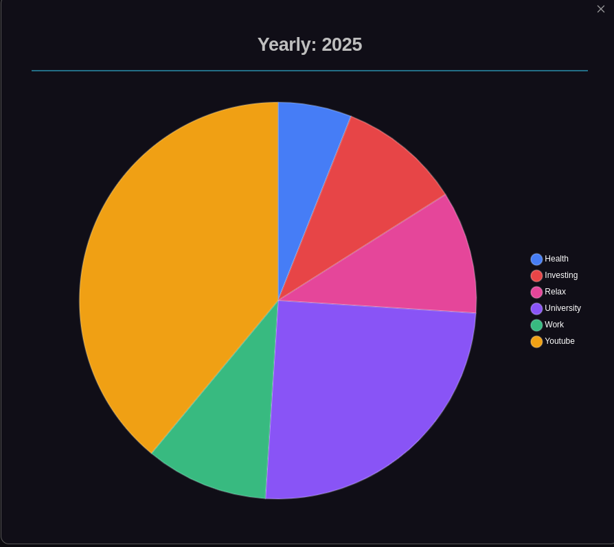

<div align="center">

# Periodix-Planner


**Turn Obsidian into a time-aware planning system: automatic periodic notes + time budgets that make trade-offs visible.**

---

## 🎬 Video: Full feature breakdown

<a href="https://www.youtube.com/watch?v=bIVNj6fkTc8" target="_blank" rel="noreferrer">
  
</a>

---

## 📸 Screenshots

<p align="center">
  <a href="https://real1tyy.github.io/Periodix-Planner/features/time-budgeting" target="_blank" rel="noreferrer">
    
  </a>
  <a href="https://real1tyy.github.io/Periodix-Planner/features/allocation-editor" target="_blank" rel="noreferrer">
    
  </a>
</p>

<p align="center">
  <a href="https://real1tyy.github.io/Periodix-Planner/features/time-budget-blocks" target="_blank" rel="noreferrer">
    
  </a>
  <a href="https://real1tyy.github.io/Periodix-Planner/features/visual-statistics" target="_blank" rel="noreferrer">
    
  </a>
</p>

</div>

## Why Periodix-Planner exists

Time is your scarcest resource. You can’t do everything — and most “planning” fails because it avoids the trade-offs.

**Periodix-Planner** helps you plan *time*, not just tasks. It treats time like a finite investment portfolio:

- You allocate hours into categories (work, learning, health, relationships, projects)
- You observe where time actually goes over time
- You decide whether those investments are worth the returns you’re getting

**This plugin is not a task manager.** Tasks are result-oriented. Periodix-Planner is time-oriented.

It complements your task manager by helping you decide what deserves your time in the first place.

## What it does

### 📅 **Automatic Periodic Note Generation**

The plugin automatically creates notes for each time period, always staying **one step ahead** by generating the next period's note in advance.

- **Daily notes** → Generated for today and tomorrow
- **Weekly notes** → Generated for this week and next
- **Monthly notes** → Generated for this month and next
- **Quarterly notes** → Generated for this quarter and next
- **Yearly notes** → Generated for this year and next

Each note is created in its designated folder with consistent naming conventions.

### 🔗 **Interconnected Note Web**

All periodic notes are intelligently linked through frontmatter properties:

```yaml
---
# Daily Note Example (2025-01-15)
Previous: "[[2025-01-14]]"
Next: "[[2025-01-16]]"
Week: "[[2025-W03]]"
Month: "[[2025-01]]"
Quarter: "[[2025-Q1]]"
Year: "[[2025]]"
---
```

**Navigation Links:**
- `Previous` / `Next` → Navigate chronologically within the same period type
- Hierarchical links → Jump from daily → weekly → monthly → quarterly → yearly

This creates a powerful **navigable web of time** that lets you zoom in and out of your planning horizon effortlessly.

### ⏱️ **Time Budget System**

Define how many hours you have available and delegate them across categories (time investments), with budgets flowing down the hierarchy:

#### Yearly Time Pool
```
Total Hours/Year: 10,000 hours
├── YouTube:          2,000 hours (20%)
├── Business:         5,000 hours (50%)
└── Health & Relationships: 3,000 hours (30%)
```

#### Cascading Allocation
Time budgets flow down through the hierarchy:
- **Yearly** → Define total category budgets
- **Quarterly** → Allocate portions of yearly budgets (plugin tracks remaining)
- **Monthly** → Allocate from quarterly budgets
- **Weekly** → Allocate from monthly budgets
- **Daily** → See available time and track actuals

#### Smart Tracking
- 🟢 **Within budget** → Green indicators
- 🟡 **Approaching limit** → Yellow warnings
- 🔴 **Over budget** → Red alerts with clear messaging

### 📊 **Visual Statistics**

- **Pie charts** → Category distribution at each time level
- **Tables** → Detailed breakdown with allocated vs. remaining
- **Progress bars** → Visual tracking of time consumption

### ✏️ **Interactive Allocation Editor**

Powerful modal for editing time allocations:
- Drag-to-adjust percentage bars
- Quick-fill buttons (10%, 25%, 50%, Max)
- Custom percentage input
- Parent budget warnings
- Undo/redo support
- Keyboard shortcuts

## 🚀 Quick Start

1. **Install** the plugin from Obsidian Community Plugins or BRAT
2. **Configure** your folder structure and naming preferences in settings
3. **Set up** your time budget categories
4. **Generate** your first set of periodic notes
5. **Allocate** time using the interactive allocation editor

See the [Installation Guide](https://real1tyy.github.io/Periodix-Planner/installation) and [Quick Start Guide](https://real1tyy.github.io/Periodix-Planner/quickstart) for detailed setup instructions.

## 📦 Installation

- **Installation**: https://real1tyy.github.io/Periodix-Planner/installation
- **Quick Start**: https://real1tyy.github.io/Periodix-Planner/quickstart

## 💡 Use Cases

### Personal Productivity
- Plan your year with clear time investments
- Track where your time actually goes
- Balance work, health, and relationships

### Goal Achievement
- Allocate dedicated hours to learning
- Track progress toward time-based goals
- Adjust allocations based on priorities

### Business Planning
- Quarterly OKR time budgets
- Project time allocation
- Resource planning across time horizons

## 📚 Documentation

Comprehensive documentation is available at: **[docs.periodix-planner.com](https://real1tyy.github.io/Periodix-Planner/)**

- [Installation Guide](https://real1tyy.github.io/Periodix-Planner/installation)
- [Quick Start](https://real1tyy.github.io/Periodix-Planner/quickstart)
- [YouTube Video Breakdown](https://real1tyy.github.io/Periodix-Planner/video)
- [Features Overview](https://real1tyy.github.io/Periodix-Planner/features/overview)
- [Time Budgeting](https://real1tyy.github.io/Periodix-Planner/features/time-budgeting)
- [Allocation Editor](https://real1tyy.github.io/Periodix-Planner/features/allocation-editor)
- [Configuration](https://real1tyy.github.io/Periodix-Planner/configuration)
- [FAQ](https://real1tyy.github.io/Periodix-Planner/faq)
- [Troubleshooting](https://real1tyy.github.io/Periodix-Planner/troubleshooting)

## 🤝 Contributing

Contributions are welcome! Please see our [Contributing Guide](https://real1tyy.github.io/Periodix-Planner/contributing) for details.

- 🐛 [Report Bugs](https://github.com/Real1tyy/Periodix-Planner/issues)
- 💡 [Request Features](https://github.com/Real1tyy/Periodix-Planner/issues)
- 📝 [Improve Documentation](https://github.com/Real1tyy/Periodix-Planner/tree/main/docs-site/docs)

## 📄 License

MIT License - see [LICENSE](LICENSE) for details.

## Support & Sponsorship

If you find Periodix-Planner useful and want to support its ongoing development, please consider becoming a sponsor. Your contribution helps ensure continuous maintenance, bug fixes, and the introduction of new features.

- [Support My Work](https://github.com/Real1tyy#-support-my-work)

Every contribution, no matter the size, is greatly appreciated!
